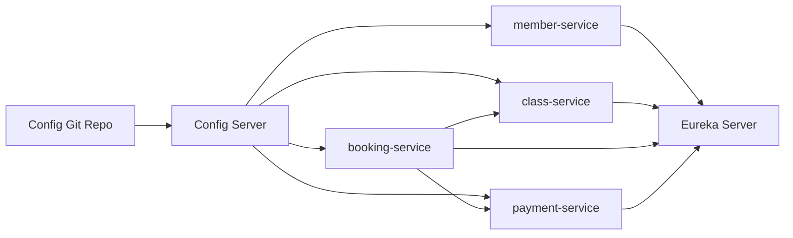

# Bài 5: Thiết kế hạ tầng Config Server và Eureka cho hệ thống GymHub

**Sinh viên:** Cam Linh  
**Lớp:** IT214 - PTIT070  
**Repo:** SS03_HW05_IT214_CamLinh_PTIT070

## 1. Bối cảnh

Em chọn hệ thống **GymHub**, dùng để quản lý chuỗi phòng gym. Người dùng có thể đăng ký gói tập, đặt lịch lớp học, check-in và thanh toán online.

4 service nghiệp vụ:

| Service | Chức năng |
|---|---|
| `member-service` | Quản lý hội viên |
| `class-service` | Quản lý lớp tập và huấn luyện viên |
| `booking-service` | Đặt lịch lớp tập |
| `payment-service` | Thanh toán gói tập |

Hạ tầng dùng thêm:

- `config-server`
- `eureka-server`

## 2. Cấu hình cần quản lý tập trung

| Service | Cấu hình cần quản lý |
|---|---|
| `member-service` | datasource, JWT secret, giới hạn số thiết bị đăng nhập |
| `class-service` | datasource, timeout gọi member, số học viên tối đa mặc định |
| `booking-service` | datasource, timeout gọi class, bật/tắt giữ chỗ tạm thời |
| `payment-service` | datasource, payment gateway URL, số lần retry |

## 3. Cấu trúc config repository

```text
gymhub-config-repo
├── application.yml
├── member-service.yml
├── member-service-dev.yml
├── class-service.yml
├── class-service-dev.yml
├── booking-service.yml
├── booking-service-dev.yml
├── payment-service.yml
└── payment-service-dev.yml
```

File được đặt theo đúng tên `spring.application.name`. Ví dụ service tên `booking-service` thì file cấu hình chung là `booking-service.yml`, còn môi trường dev là `booking-service-dev.yml`.

## 4. Config Server

Config Server chạy ở port `8888` và đọc cấu hình từ Git:

```yaml
server:
  port: 8888

spring:
  application:
    name: config-server
  cloud:
    config:
      server:
        git:
          uri: https://github.com/camlinh/gymhub-config-repo
          default-label: main
```

Khi `booking-service` chạy profile `dev`, nó lấy cấu hình từ:

```text
http://config-server:8888/booking-service/dev
```

## 5. Eureka Server

Eureka Server chạy port `8761`:

```yaml
server:
  port: 8761

spring:
  application:
    name: eureka-server

eureka:
  client:
    register-with-eureka: false
    fetch-registry: false
```

Eureka Server không cần tự đăng ký chính nó.

## 6. Eureka Client cho 4 service

Mỗi service nghiệp vụ dùng cấu hình chung:

```yaml
eureka:
  instance:
    instance-id: ${spring.application.name}:${random.uuid}
    prefer-ip-address: true
  client:
    register-with-eureka: true
    fetch-registry: true
    service-url:
      defaultZone: http://eureka-server:8761/eureka/
```

Nếu `booking-service` scale thành 3 instance, cả 3 instance đều đăng ký với tên `booking-service`, nhưng `instance-id` khác nhau. Service khác chỉ gọi:

```text
http://booking-service/api/bookings
```

## 7. Sơ đồ tổng thể



## 8. Kết luận

Với GymHub, Config Server giúp gom cấu hình của các service vào một nơi, dễ đổi theo môi trường dev/prod. Eureka giúp các service gọi nhau bằng tên thay vì IP hoặc port cứng. Khi scale service lên nhiều instance, Eureka vẫn quản lý được danh sách instance để client load balance.
